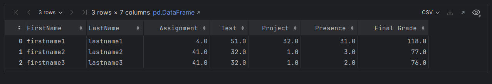

<h1> GradeBook DataFrame - Python Project</h1>
 
<h2>Features</h2>
<ul>
    <li> Creating table with students</li>
    <li> Exporting DataFrame to .csv </li>
    <li> Modify values from students </li>
    <li> Remove columns from table </li>
    <li> Remove rows from table </li>
    
</ul>

<h2>Acknowledgments</h2>

<b> Python3: https://drive.google.com/file/d/1B5VibXhlzQz9aaz7_ck7NlOkGREgFUHg/view?usp=drive_link <b>
 

<h2>Photo</h2>

 

<h2>Contact</h2>

<b> Email: mariusc0023@gmail.com </b>
